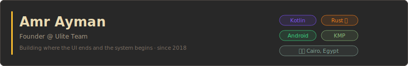
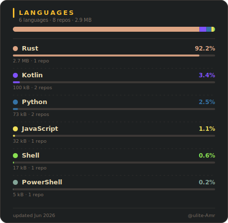

---

Android developer since 2018. I work with Kotlin and KMP for cross-platform mobile, and I'm moving performance-critical and security-sensitive logic to Rust — keeping the UI layer thin and the core fast.

---

&nbsp;

